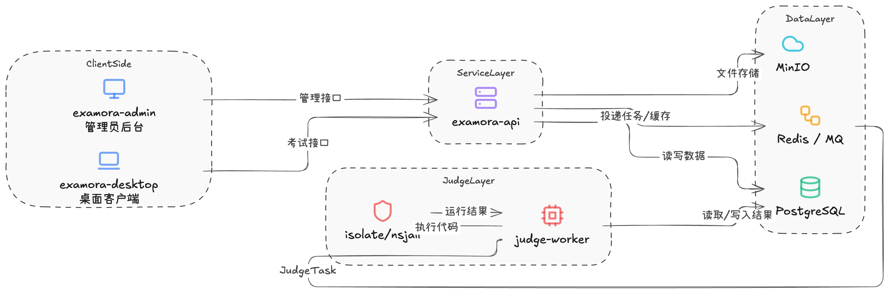

# Examora

[](https://github.com/coding-hui/examora/actions/workflows/ci.yml)
[](https://github.com/coding-hui/examora/actions/workflows/deploy-website.yml)
[](LICENSE)

Examora is an open-source online examination platform for managed exams, programming assessments, and desktop-secured exam sessions.

The project is under active MVP development. Core backend domains are being implemented first, with the admin console, desktop client, judging pipeline, and public documentation evolving in parallel.

Documentation: <https://coding-hui.github.io/examora/>

## What Examora Provides

- Exam and paper management for administrators
- Question bank workflows for objective and programming questions
- Candidate exam sessions with answer persistence and submission tracking
- Asynchronous judging through Redis-backed tasks
- A sandbox runner boundary for code execution
- Logto-oriented authentication design with Examora-owned business roles
- A documentation website for architecture, lifecycle, API, and roadmap notes

## Architecture



Examora is split into a small set of explicit runtime boundaries:

| Layer | Components | Responsibility |
| --- | --- | --- |
| Clients | `apps/admin`, `apps/desktop` | Administrator workflows and candidate exam experience |
| API | `cmd/api`, `internal/api`, domain services | HTTP API, authentication, exam lifecycle, library management, judge orchestration |
| Worker | `cmd/worker`, `internal/judge/worker` | Asynchronous judge task processing |
| Sandbox | `cmd/sandbox`, `internal/server/sandbox.go` | Isolated execution boundary exposed to the judge service |
| Data | PostgreSQL or SQLite, Redis | Persistence, queueing, token blacklist, task coordination |
| Docs | `website` | Public documentation and project planning |

## Repository Layout

```text
examora/
├── apps/
│   ├── admin/              # Umi/React administrator console
│   └── desktop/            # Tauri + Vue desktop exam client
├── cmd/
│   ├── api/                # Go API server entrypoint
│   ├── worker/             # Go judge worker entrypoint
│   └── sandbox/            # Go sandbox runner entrypoint
├── internal/
│   ├── api/                # HTTP handlers and API DTOs
│   ├── auth/               # Auth, RBAC, token, and Logto integration
│   ├── exam/               # Exam lifecycle and submissions
│   ├── infra/              # Config, database, Redis, logging, transactions
│   ├── judge/              # Judge services, queueing, sandbox client, worker
│   ├── library/            # Question and paper management
│   └── server/             # Runtime assembly for API, worker, and sandbox
├── packages/
│   ├── client/             # Shared frontend API client package
│   ├── types/              # Shared TypeScript contracts
│   └── utils/              # Shared TypeScript utilities
├── deploy/                 # Dockerfiles and docker-compose stack
├── migrations/             # Database migration assets
├── website/                # Docusaurus documentation site
├── Makefile
└── go.mod
```

## Prerequisites

- Go 1.25 or newer
- Node.js 20 or newer
- pnpm 9 or newer
- Docker and Docker Compose
- Optional: `golangci-lint` for local linting

## Quick Start

Start the local Docker stack:

```bash
docker compose -f deploy/docker-compose.yml up --build
```

The compose stack starts PostgreSQL, Redis, the API server, the judge worker, and the sandbox runner. The API listens on port `8080` by default.

For local backend development without rebuilding containers:

```bash
cp .env.example .env
docker compose -f deploy/docker-compose.yml up -d postgres redis

# In separate terminals as needed:
go run ./cmd/api
go run ./cmd/worker
go run ./cmd/sandbox
```

Configuration is read from environment variables. When running binaries directly, export values from `.env` in your shell or rely on the development defaults in `internal/infra/config`.

## Frontend and Documentation

Admin console:

```bash
pnpm --dir apps/admin install
pnpm --dir apps/admin start
pnpm --dir apps/admin build
```

Documentation website:

```bash
pnpm --dir website install
pnpm --dir website start
pnpm --dir website build
```

The documentation site is deployed to GitHub Pages by `.github/workflows/deploy-website.yml`.

## Common Development Commands

```bash
make infra-up      # start the Docker Compose stack
make infra-down    # stop the Docker Compose stack
make go-check      # run Go tests with a local GOCACHE
make api           # run the API server
make worker        # run the judge worker
make sandbox       # run the sandbox runner
make lint          # run golangci-lint
make test          # run Go tests
```

Additional direct checks:

```bash
go build ./...
go test ./...
pnpm --dir apps/admin build
pnpm --dir website build
```

## Configuration

The main environment variables are documented in `.env.example`.

| Variable | Purpose |
| --- | --- |
| `APP_HOST`, `APP_PORT` | API bind address |
| `DATABASE_DSN` | PostgreSQL DSN or local SQLite path |
| `REDIS_ADDR`, `REDIS_PASSWORD`, `REDIS_DB` | Redis connection settings |
| `SANDBOX_ADDR` | Sandbox runner URL used by judge services |
| `LOGTO_ENABLED`, `LOGTO_ENDPOINT`, `LOGTO_APP_ID`, `LOGTO_API_AUDIENCE` | Logto authentication settings |
| `JWT_SECRET` | Local JWT signing secret for development auth flows |

Do not commit real `.env` files or production credentials.

## Security Model

- Candidate-facing APIs must not expose `answer_json`, hidden tests, or scoring internals.
- Published exams should be scored from immutable snapshots rather than mutable source questions.
- Desktop anti-cheat events are audit signals, not proof of cheating.
- The sandbox runner must remain isolated from PostgreSQL, Redis, and business credentials.

Please report sensitive security issues privately instead of opening a public issue.

## Project Status

Examora is pre-1.0 software. APIs, schemas, package boundaries, and deployment details may change while the MVP is being finalized.

Near-term work is tracked in the public documentation roadmap:

- <https://coding-hui.github.io/examora/docs/planning/roadmap>

## Contributing

Contributions are welcome while the project is still taking shape.

Before opening a pull request:

1. Keep changes focused and aligned with the current module boundaries.
2. Add or update tests for scoring, snapshots, authentication, and judge-flow behavior.
3. Run the relevant checks:

```bash
go build ./...
go test ./...
pnpm --dir apps/admin build
pnpm --dir website build
```

Pull requests should describe the motivation, scope, schema or API impact, and verification steps. Include screenshots for UI changes.

## License

Examora is licensed under the [Mozilla Public License 2.0](LICENSE).
